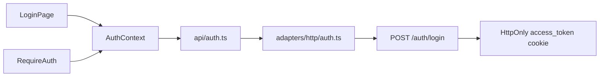

# Architecture

## Overview

```
main.tsx
  └── App.tsx
        └── AppProviders (MotionConfig, AuthProvider, Suspense)
              └── RouterProvider
                    ├── /login          → LoginPage
                    ├── /client/*       → RequireAuth → AppShell → pages
                    └── /admin/*        → RequireAuth → AppShell → pages
```

## Data flow

```mermaid
flowchart LR
  Pages[pages/components] --> Repo[api/repository.ts]
  Repo --> Http[adapters/http/repository.ts]
  Http --> Client[ApiClient fetch]
  Client --> Proxy[/api reverse proxy]
  Proxy --> Backend[leads_to_conversion BE :8870]
  Backend --> MongoDB[(MongoDB)]
```

All UI code calls `repo.getCampaigns()`, `repo.getLeads()`, etc. The `repo` facade
hard-wires the HTTP adapter — there is no data-source switch and no mock adapter.
`ApiClient` (`src/api/adapters/http/client.ts`) issues `fetch` against
`env.apiBaseUrl` (default `/api`), which `vite.config.ts` reverse-proxies to the
backend on `127.0.0.1:8870` (rewriting `/api` off). The adapter translates BE
snake_case + enum shapes into the FE domain types.

## Auth flow



Single-admin JWT. `POST /auth/login` sets an HttpOnly `access_token` cookie;
`GET /auth/me` returns `{user:{username}}`, which the adapter mirrors into the FE
session shape `{ zone, email, name }` kept in `sessionStorage` (for routing/zone
state only — the JWT itself stays in the cookie). The backend is single-tenant:
both the client and admin zones resolve to the one admin account.

## Zones

| Zone | Base path | Shell | Navigation |
|------|-----------|-------|------------|
| Client | `/client` | `AppShell zone="client"` | `lib/navigation.ts` → `clientNavigation` |
| Admin | `/admin` | `AppShell zone="admin"` | `lib/navigation.ts` → `adminNavigation` |

## Design system

- **Tokens**: `src/styles/globals.css` (`@theme` block)
- **Primitives**: `src/components/ui/` (Button, Modal, Drawer, etc.)
- **Motion**: `src/lib/motion.ts` + `motion/react`
- **Layout**: `PageHeader`, `PageContainer` in `src/components/layout/`

## Code splitting

Route screens are lazy-loaded in `src/app/routes/client.routes.tsx` and
`admin.routes.tsx`. `AppShell` wraps child routes in `Suspense`.

## Async data state

Data loads are async (real network). Screens use `useAsyncData`
(`src/hooks/useAsyncData.ts`) for loading/error/reload state and render
`LoadingState` / `ErrorState` (retry) / `EmptyState` from `src/components/ui/`.
The backend has no server-side mock or fallback path; a 404/empty response means
the endpoint is not implemented yet (a deferred product feature) and the screen
shows empty/error — never fabricated data.

## Backward compatibility

`src/data/repository.ts` and `src/data/time.ts` re-export from the new API layer.
Prefer `@/api/repository` in new code.
