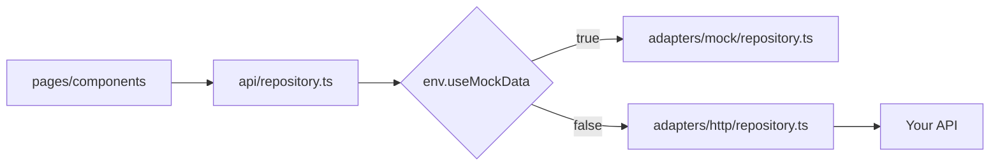
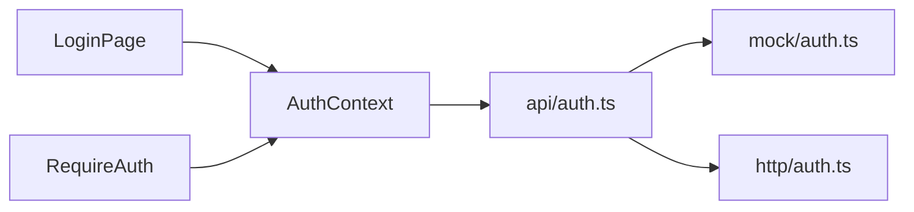

# Architecture

## Overview

```
main.tsx
  └── App.tsx
        └── AppProviders (MotionConfig, AuthProvider, Suspense)
              └── RouterProvider
                    ├── /login          → LoginPage
                    ├── /client/*       → RequireAuth → AppShell → pages
                    └── /admin/*        → RequireAuth → AppShell → pages
```

## Data flow



All UI code calls `repo.getCampaigns()`, `repo.getLeads()`, etc. The facade selects the adapter at runtime.

## Auth flow



Session shape: `{ zone: 'client' | 'admin', email, name }` stored in `sessionStorage`.

## Zones

| Zone | Base path | Shell | Navigation |
|------|-----------|-------|------------|
| Client | `/client` | `AppShell zone="client"` | `lib/navigation.ts` → `clientNavigation` |
| Admin | `/admin` | `AppShell zone="admin"` | `lib/navigation.ts` → `adminNavigation` |

## Design system

- **Tokens**: `src/styles/globals.css` (`@theme` block)
- **Primitives**: `src/components/ui/` (Button, Modal, Drawer, etc.)
- **Motion**: `src/lib/motion.ts` + `motion/react`
- **Layout**: `PageHeader`, `PageContainer` in `src/components/layout/`

## Code splitting

Route screens are lazy-loaded in `src/app/routes/client.routes.tsx` and `admin.routes.tsx`. `AppShell` wraps child routes in `Suspense`.

## Mutable session state

Some features use in-memory stores (notes, tags, campaign drafts, admin approvals). These live in `api/adapters/mock/` and simulate backend writes. When wiring HTTP:

- Move writes to API calls
- Consider React Query or SWR for caching/refetch

## Backward compatibility

`src/data/repository.ts` and `src/data/time.ts` re-export from the new API layer. Prefer `@/api/repository` in new code.
